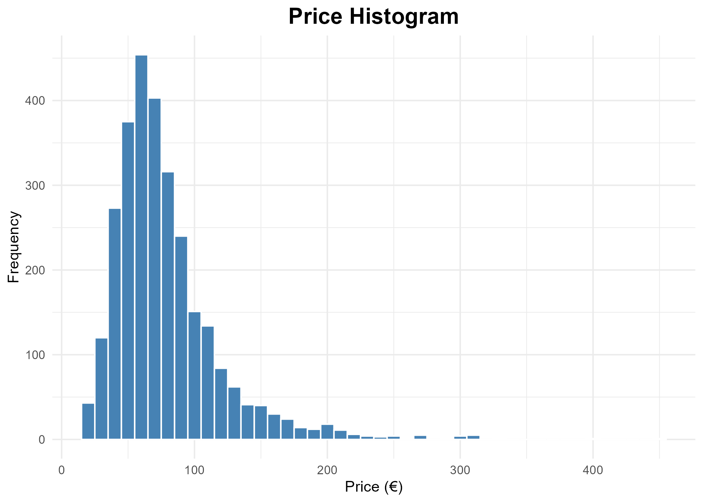
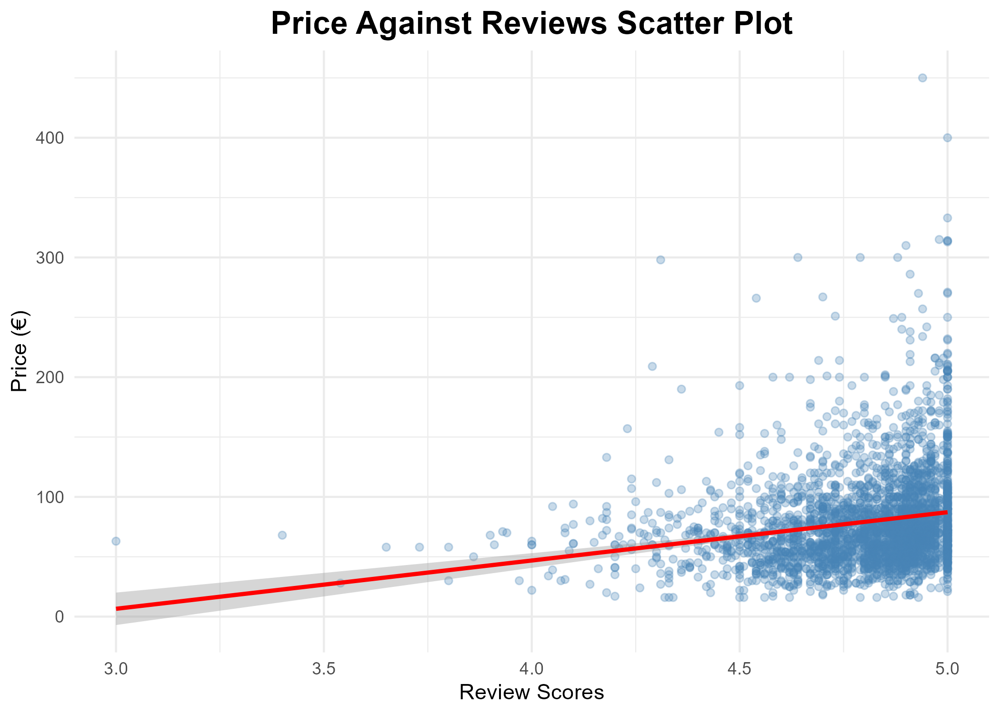
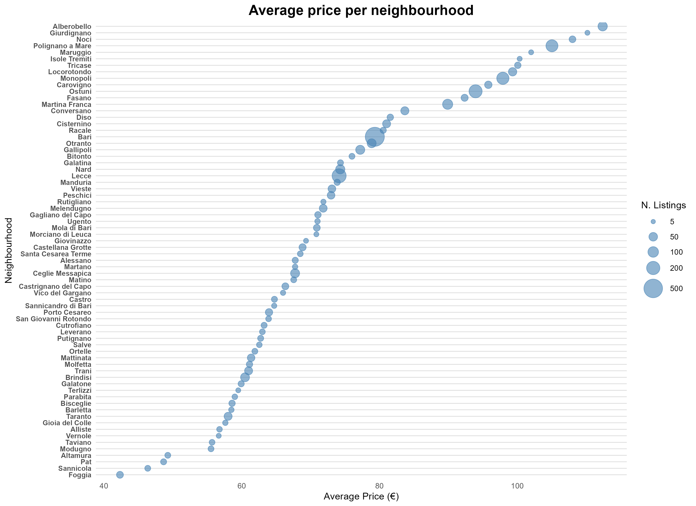
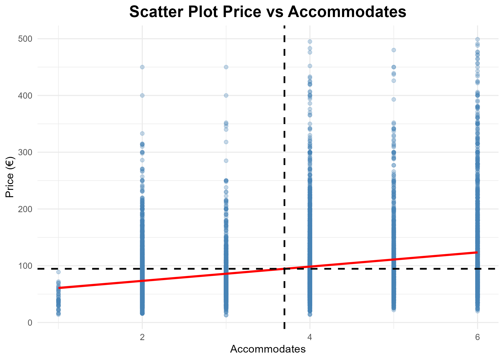
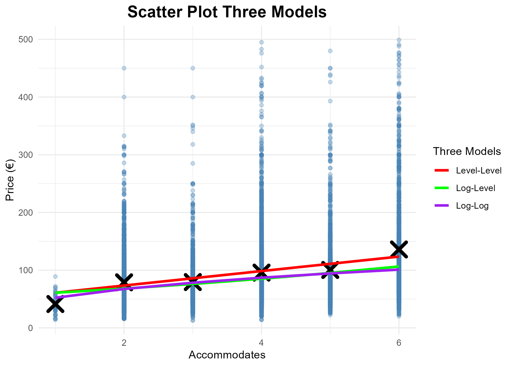

# Introduction {.unnumbered}

This report summarizes the data cleaning process and the empirical analysis of Airbnb listings in the Puglia region, aiming to understand the relationship between prices, review scores, accommodation capacity, and neighborhood characteristics.

# Task 1: Basic data cleaning

The analysis started with the raw dataset of listings in Puglia. Numeric variables that arrived as strings were cleaned, currency symbols were removed, and listings with missing prices or ratings, those with less than 10 reviews, and those with prices above 500 euros were filtered out. There are 11,788 observations remaining after cleaning, which is less than 1/4 of the original sample.

# Task 2: Descriptive statistics

@tbl-summary-stats reports the summary statistics for our main variables. Prices are right-skewed (median $<$ mean), and they have a high standard deviation. They cover a wide range (from 13 to 499). Reviews distribution is much more stable and informative, with data concentrated around 4.8 with a low standard deviation. The 'accommodates' variable have relatively big positive outliers, but both mean and median are around 4.

| Variable | Mean | Median | SD | Min | Max | N |
|:---|---:|---:|---:|---:|---:|---:|
| Price | 103.47 | 81.00 | 71.89 | 13 | 499 | 11788 |
| Review Score | 4.80 | 4.86 | 0.19 | 3 | 5 | 11788 |
| Accommodates | 4.16 | 4.00 | 2.03 | 1 | 16 | 11788 |

: Summary Statistics (Price, Reviews, Accommodates) {#tbl-summary-stats}

# Task 3: Price-review relationship

The sample was restricted to listings accommodating exactly two guests. @fig-price-hist shows the distribution of prices, while @fig-scatter-rev plots price against review scores. The calculated correlation coefficient confirms what is observed in the graph: there is a slightly positive correlation between prices and review scores.

{#fig-price-hist width=70%}

{#fig-scatter-rev width=70%}

# Task 4: Neighborhood heterogeneity

@fig-neigh displays the average price across different neighborhoods. The cheapest neighbourhood is Foggia. This could be explained by the city's reputation, as it is often associated with higher crime rates and lower urban maintenance. On the other hand, the most expensive is Alberobello, a very well-known and highly demanded tourist destination.

{#fig-neigh}

# Task 5: Simple regression analysis

Filtering the sample for listings accommodating up to 6 guests, simple linear regressions were estimated. Regressing price on review scores, the slope is $57.43$. Keeping other factors constant, a 1-point increase in review score is associated with a $57.43$ euros increase in price. Regressing price on accommodates, the slope is $12.53$. Accommodating one more guest is associated with a $12.53$ euros increase in price.

When verifying the sample moment conditions for the latter regression, the difference between the actual mean and the predicted mean is very small, imputable to coefficient rounding. Manual calculations also verified that $TSS = ESS + RSS$.

{#fig-scatter-acc width=50%}

@tbl-models reports three different specifications. In the Level-Level model, for each one-unit unit guest capacity increase, price increases by $12.53$ euros. In the Log-Level model, for each 1 unit guest capacity increase, price increases by $11.2\%$. In the Log-Log model, for each $1\%$ increase in guest capacity, price increases by $0.368\%$.

I would choose the Log-Level model as the most adequate. It has the highest $R^2$, and economically it is more likely that more guest capacity implies a percentage increase in price rather than an absolute value.

::: {#tbl-models}


Regression Results: Level-Level, Log-Level, and Log-Log Specifications
:::

{#fig-models-scatter width=60%}

As an alternative functional form, instead of treating the effect of an additional guest as constant, we could use a dummy variable for each number of accommodates (from 1 to 6) to capture non-linear, step-specific effects.