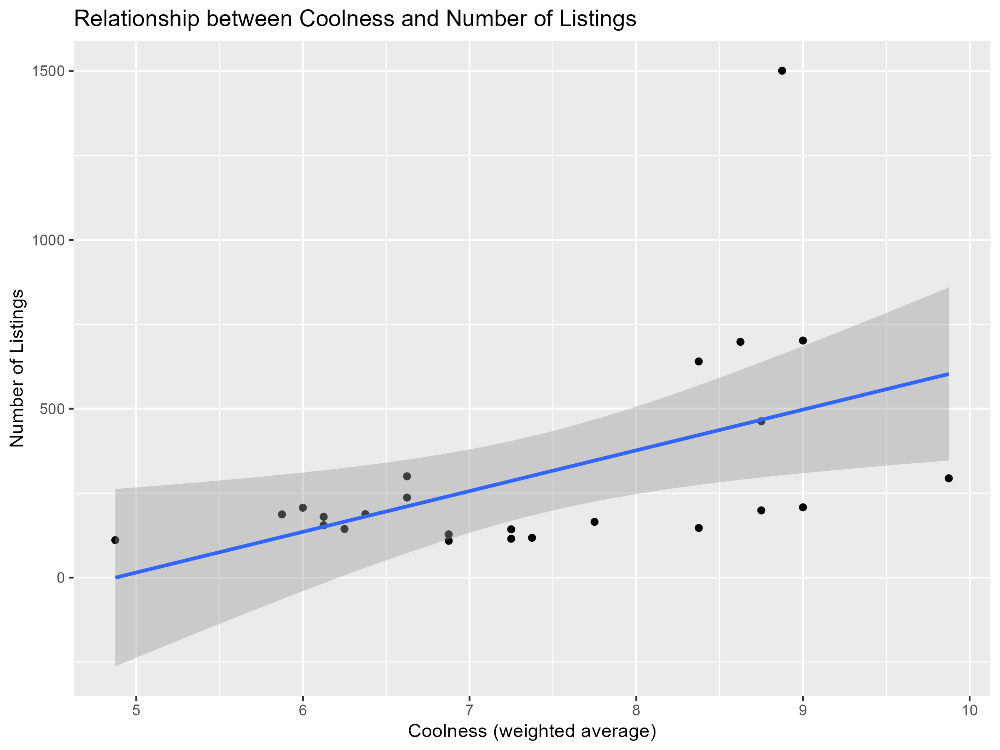
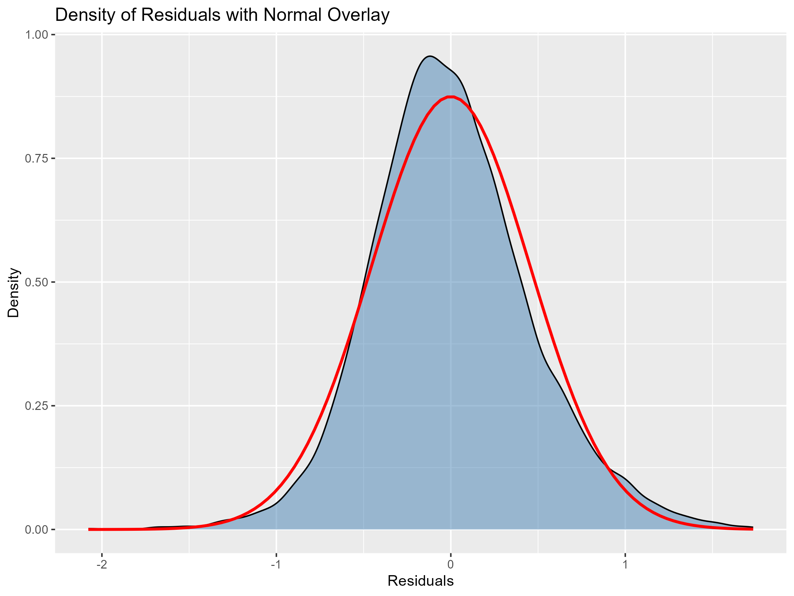
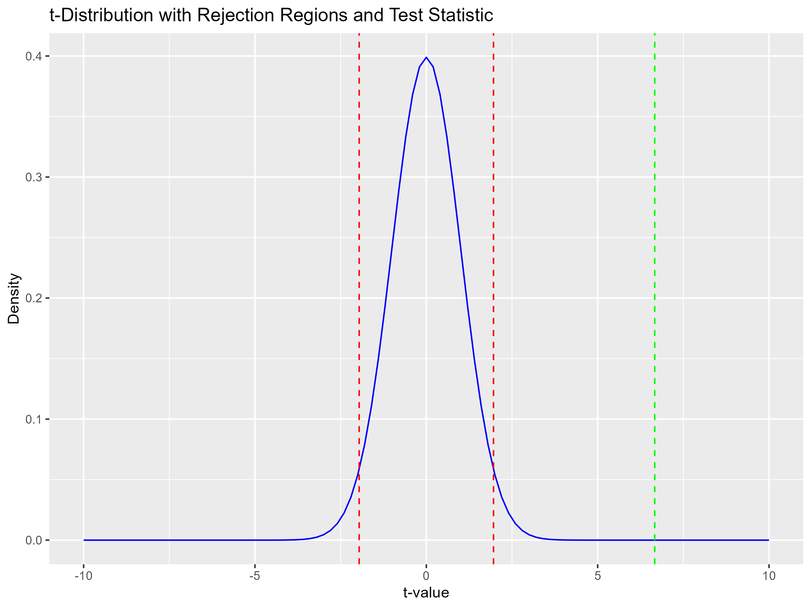
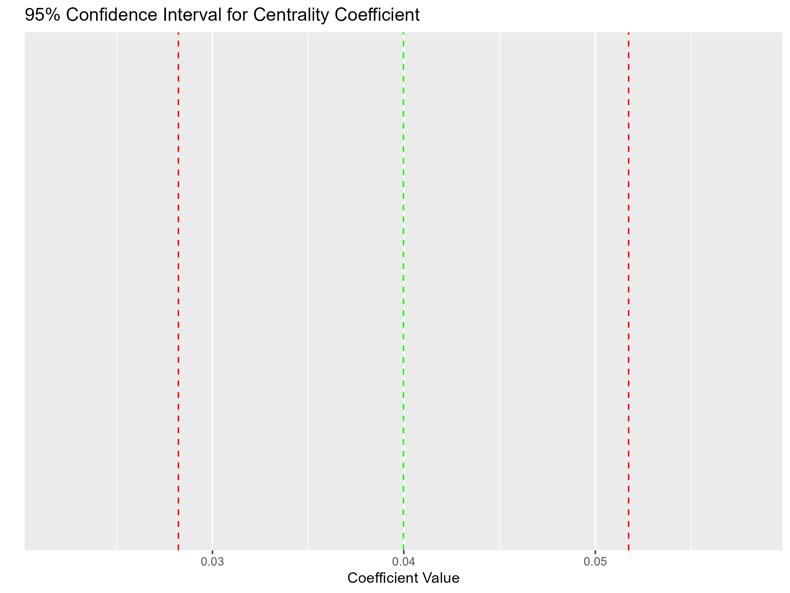

```{r}
#| label: setup-region
#| include: false
library(here)
source(here::here("datasets", "airbnb", "_config_airbnb.R"))

listings_week2_path <- file.path(AIRBNB_PROC, paste0("listings_", tolower(REGION), "_week2.rds"))
if (file.exists(listings_week2_path)) {
  listings_week2 <- readRDS(listings_week2_path)
  neigh <- stringi::stri_trans_general(listings_week2$neighbourhood_cleansed, "Latin-ASCII")
  n_locations <- sum(table(neigh) > 100, na.rm = TRUE)
} else {
  n_locations <- NA_integer_
}
n_locations_text <- if (is.na(n_locations)) "multiple" else as.character(n_locations)
```

# Introduction {.unnumbered}

This report extends the analysis from Week 1 by introducing multiple regression, neighborhood-level controls generated via AI agents, and formal inference (t-tests, confidence intervals, F-tests) on Airbnb listings in `r REGION`.

# Task 1: Data preparation and baseline models

Starting from the cleaned `r REGION` dataset, listings were filtered to those accommodating up to 6 guests. A standardized review score variable (*rating*, mean 0, sd 1) was created.

Two baseline models were estimated:

- **Model 1**: $\log(\text{price}) = \beta_0 + \beta_1 \text{rating} + u$
- **Model 2**: $\log(\text{price}) = \beta_0 + \beta_1 \text{rating} + \beta_2 \text{accommodates} + u$

The omitted-variable decomposition was performed by regressing *rating* on *accommodates* to obtain $\tilde{\delta}_1$. This confirms the OVB formula: $\tilde{\beta}_1 = \hat{\beta}_1 + \hat{\beta}_2 \tilde{\delta}_1$, where $\tilde{\beta}_1$ is the coefficient from Model 1, and $\hat{\beta}_1$, $\hat{\beta}_2$ are from Model 2.

# Task 2: Neighborhood controls and full model

Only neighborhoods with at least 100 observations were retained (`r n_locations_text` locations across `r REGION`). Four neighborhood characteristics were generated using AI agents:

- **Coolness**: attractiveness for the 20--30 age group and nightlife.
- **Centrality**: logistic/touristic importance and connectivity within `r REGION`.
- **Quietness**: night-time silence (higher = quieter).
- **Fanciness**: prestige, architectural elegance, and shop/restaurant quality.

Three AI agents were queried with the same prompt: ChatGPT, Gemini (thinking mode) and Perplexity (Deep Research). The final scores are a weighted average (ChatGPT 0.25, Gemini 0.25, Perplexity 0.50), giving more weight to Perplexity for its more detailed and comprehensive research process. Score CSVs are stored in `datasets/airbnb/neigh_scores/`, while prompt and reasoning documentation is stored in `week_2/analysis/input/agents/`.

@tbl-summ-var reports the summary statistics for the four neighborhood variables.

::: {#tbl-summ-var}


Summary Statistics for Neighborhood Variables
:::

A third model was estimated adding the four neighborhood controls:

- **Model 3**: $\log(\text{price}) = \beta_0 + \beta_1 \text{rating} + \beta_2 \text{accommodates} + \beta_3 \text{coolness} + \beta_4 \text{centrality} + \beta_5 \text{quietness} + \beta_6 \text{fanciness} + u$

@tbl-three-models reports the regression results for all three specifications.

::: {#tbl-three-models}


Regression Results: Model 1, Model 2, and Model 3
:::

**Interpretation of Model 3.** Centrality and fanciness have positive and highly significant coefficients: a one-unit increase in fanciness is associated with a $12.6\%$ price increase, while a one-unit increase in centrality corresponds to a $4\%$ increase. Quietness has a negative sign, suggesting that quieter (more peripheral) neighborhoods command lower prices. Coolness is surprisingly negative ($-11.1\%$ per unit). This may reflect higher supply pressure: cooler neighborhoods attract more hosts, increasing competition and pushing prices down. @fig-coolness-nlistings confirms a positive relationship between coolness and the number of listings.

{#fig-coolness-nlistings width=70%}

Compared to Model 2, the *rating* coefficient is essentially unchanged, while *accommodates* rose from $0.109$ to $0.124$, suggesting that guest capacity becomes more important once neighborhood characteristics are controlled for. $R^2$ increased from $0.129$ to $0.187$ and RMSE decreased, confirming Model 3 as the best-fitting specification.

# Task 3: Normality and t-tests

Residuals from Model 3 were extracted to assess normality. @fig-residuals-density shows the residual density overlaid with a normal curve; the distribution exhibits heavier tails and slight skewness. The Jarque--Bera test formally rejects normality ($p < 0.05$), meaning we cannot assume normally distributed errors. However, given the large sample size ($n = 7{,}339$), inference based on asymptotic normality of OLS estimators remains valid by the CLT.

{#fig-residuals-density width=50%}

For the centrality coefficient, a two-sided t-test of $H_0: \beta_{\text{centrality}} = 0$ vs. $H_1: \beta_{\text{centrality}} \neq 0$ was conducted manually:

- **t-statistic**: $6.67$
- **p-value**: $2.83 \times 10^{-11}$
- **5% critical value**: $\pm 1.96$

The t-statistic falls deep into the rejection region. We reject $H_0$ and conclude that centrality is a statistically significant predictor of price. @fig-t-dist illustrates the t-distribution with rejection regions and the test statistic.

{#fig-t-dist width=60%}

# Task 4: Confidence interval and joint F-test

A 95% confidence interval for $\beta_{\text{centrality}}$ was computed manually as $\hat{\beta} \pm t_{0.975} \cdot \text{SE}(\hat{\beta})$. The interval does not include zero, which is consistent with the t-test rejection of $H_0$. Both approaches are equivalent: the t-test rejects at $5\%$ if and only if the $95\%$ confidence interval excludes the null value.

{#fig-conf-interval width=50%}

A joint F-test was conducted on the null hypothesis $H_0: \beta_{\text{centrality}} = \beta_{\text{quietness}} = \beta_{\text{coolness}} = \beta_{\text{fanciness}} = 0$. The F-statistic was computed manually from the restricted (Model 2) and unrestricted (Model 3) residual sum of squares, and verified via `anova()`. The test strongly rejects the null, confirming that the four neighborhood characteristics are jointly significant predictors of log-price.
